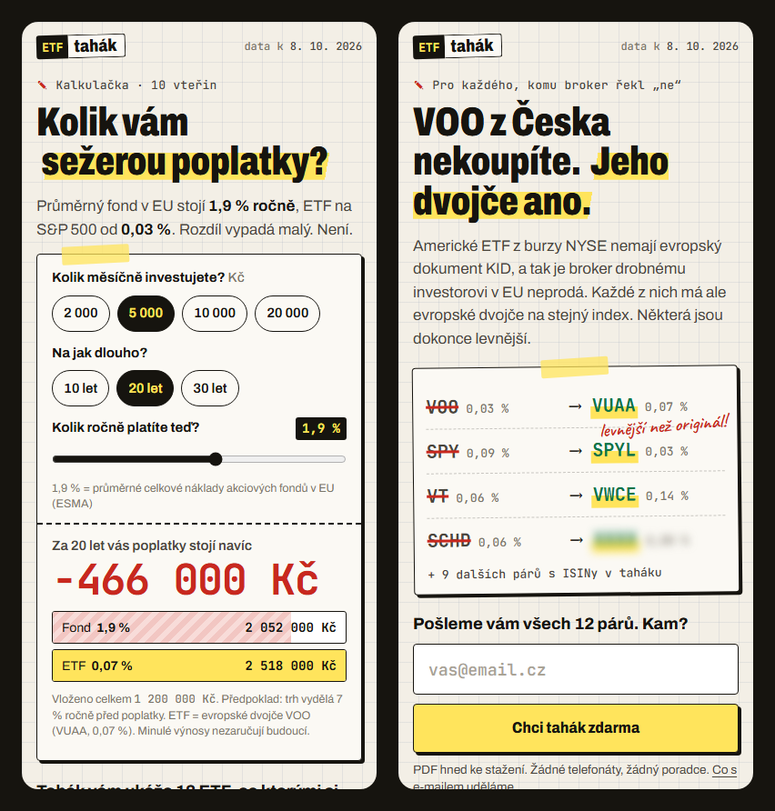
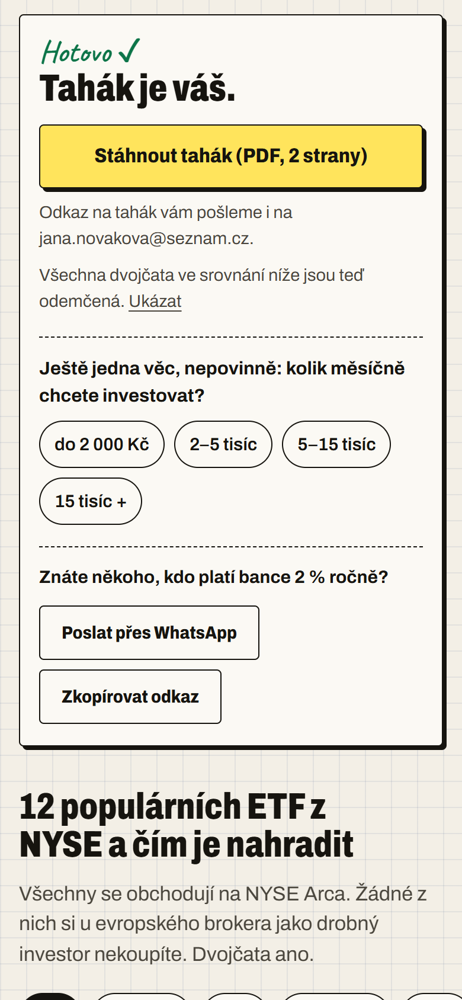
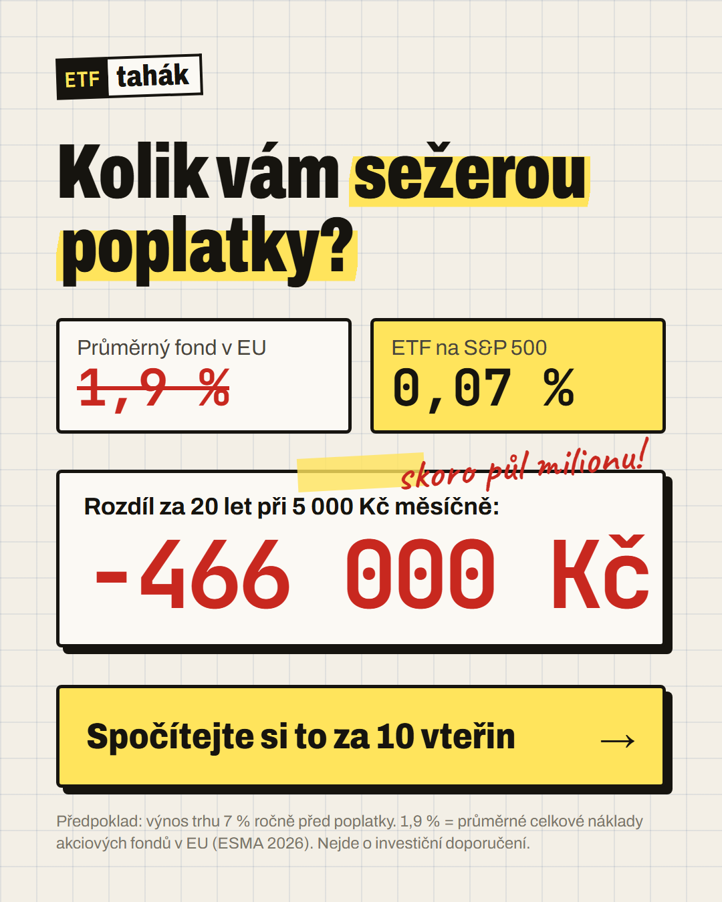
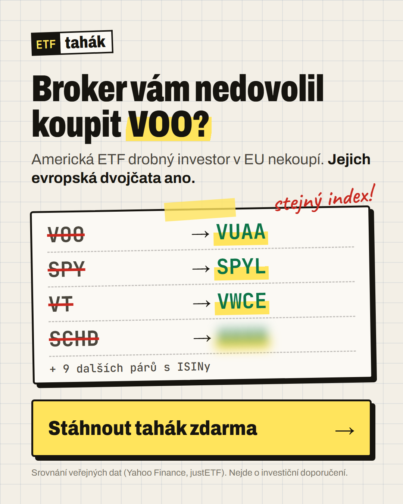

# ETF tahák: conversion landing page

A lead-magnet landing page that compares **12 NYSE-listed ETFs** for **Czech retail investors arriving from a mobile ad**. In exchange for an email, visitors get a 2-page cheat sheet ("tahák") that maps every US ETF to the European twin they can actually buy.

**Live:** _deploy URL_ · **Variants:** [fees (ad A)](_deploy URL_/?utm_content=fees-feed) · [twins (ad B)](_deploy URL_/?utm_content=twins-feed) · **Lead magnet:** [`etf-tahak-2026.pdf`](public/tahak/etf-tahak-2026.pdf) · **Plan as agreed:** [`docs/PLAN.md`](docs/PLAN.md)



---

## 1. The insight the page is built on

The brief says "compare NYSE ETFs for a Czech retail investor". The catch is that **a Czech retail investor can't buy them.** Since 2018 the EU PRIIPs regulation requires a KID document for any product sold to retail clients. US issuers don't publish one, so Czech/EU brokers block VOO, SPY, VT & co. Every Czech beginner who learns about investing from US YouTube/Reddit runs into this wall.

So the comparison has a second column nobody else puts next to it: **each NYSE ETF's European (Irish UCITS) twin** on the same index, with ISIN, fee, and how close the match is. That makes the page useful for this audience (a generic ETF table wouldn't be), and it gives the ad a strong hook.

## 2. Target group

| | |
|---|---|
| **Who** | Czech, 25–40, urban, net income above average, **on mobile** (Instagram/Facebook feed or stories). |
| **Money today** | Savings account, or a bank mutual fund / pension product with 1.5–2.5 % yearly costs. |
| **Knows** | "S&P 500", "ETF", maybe VOO/SPY from US content. Heard ETFs are cheap. |
| **Doesn't know** | Which ETF to pick, why the broker app says no, how Czech taxes work (3-year time test, 100k CZK limit, DIP). |
| **Fears** | Fees eating returns; doing something wrong with taxes; **being called by a "finanční poradce"**, a strong negative in CZ after years of commission-driven sales. |
| **Behaviour** | Gives the page 3–5 seconds. Decides on the first screen. Won't fill more than one field for a freebie. |

The copy talks to that person: Czech, "vy", concrete numbers, no jargon without explanation, and an explicit **"Žádné telefonáty, žádný poradce"** ("no calls, no advisor") under every form.

## 3. What the visitor gets, and when we ask

**The offer:** *ETF tahák 2026*, a 2-page PDF:
1. 12 NYSE ETFs side by side: fee, 10-year and 1-year return, focus.
2. Each one's **European twin**: ticker (Xetra + London), ISIN, TER, accumulating/distributing, match quality.
3. **Czech taxes on one page**: 3-year time test (no 40M cap since 2026), 100,000 CZK yearly exemption, accumulating vs distributing, W-8BEN, DIP deduction up to 48,000 CZK, US estate-tax risk.
4. **5 steps to the first purchase** + what to watch out for.

Plus a short follow-up sequence (4 emails: choosing a broker → standing order → taxes in depth → DIP step by step).

**The value is visible before the form:**
- Ad A visitors see **their own loss number** in the first screen (e.g. *−466,000 CZK over 20 years*).
- Ad B visitors see **3 real pairs** (VOO→VUAA, SPY→SPYL, VT→VWCE) and a blurred 4th.
- The table shows full data for 12 ETFs; only the twins of 9 are blurred, with a "🔒 Odemknout" ("Unlock") button.

**When we ask (one field: email):**

| Moment | Why there |
|---|---|
| **Right under the calculator result** (ad A) | The moment of peak loss-aversion: they just saw a six-figure number. The form label bridges the gap: *"Tahák vám ukáže 12 ETF, se kterými si ten rozdíl necháte"* ("the cheat sheet shows you 12 ETFs that let you keep that money"). |
| **In the hero** (ad B) | Ad B already promised the cheat sheet; the hero shows 3 of the 12 pairs. Those who decided on the ad can convert in one step. |
| **Clicking a blurred twin** | Curiosity → scrolls to the form and focuses the input. |
| **Sticky bottom bar** | Appears after the first screen, hides whenever a form is on screen. |
| **Final block** | For the scroll-to-the-end readers, after objections are answered. |

**After submitting:**
- **Instant value, no inbox needed:** "Hotovo ✓ Tahák je váš" ("Done ✓ The cheat sheet is yours") + download button. All twins in the table **unlock in place** (highlight animation). Email delivery is a bonus, not the gate.
- **Progressive profiling** (optional, one tap): *"Kolik měsíčně chcete investovat?"* ("How much do you want to invest monthly?"). Asked *after* the conversion, so it costs nothing and segments the leads.
- **Share loop:** WhatsApp / copy link (*"Znáte někoho, kdo platí bance 2 % ročně?"*, "Know someone paying their bank 2 % a year?"), tagged `utm_source=share`.
- Returning visitors see *"Tahák už máte ✓"* ("You already have the cheat sheet ✓") instead of forms. No double asks, no double-counted leads.
- Email typos on the big Czech domains are caught (*"Nemysleli jste …@seznam.cz?"*, "Did you mean …@seznam.cz?"). A lead with a typo is a paid click thrown away.



## 4. The two ads

Both are designed for Meta (Instagram/Facebook), feed 4:5 and story 9:16 (story versions keep the top 14 % and bottom 20 % clear of UI). Sources: [`public/ads/*.html`](public/ads), rendered PNGs in [`public/ads/`](public/ads).

| Ad A: "fees" (loss aversion) | Ad B: "twins" (curiosity + frustration) |
|---|---|
|  |  |
| **Primary text:** Průměrný akciový fond v EU si každý rok strhne 1,9 % (ESMA). ETF na S&P 500 stojí od 0,03 %. Zní to jako drobnost, ale při 5 000 Kč měsíčně je to za 20 let skoro půl milionu korun. Spočítejte si svoje číslo, zabere to 10 vteřin. | **Primary text:** Chtěli jste koupit VOO, SPY nebo VT a broker vám to nedovolil? Nejste sami. Americká ETF drobný investor v EU nekoupí, chybí jim dokument KID. Každé z nich má ale evropské dvojče na stejný index. Sepsali jsme je na jeden tahák: 12 párů s ISINy a daně v kostce. Zdarma. |
| **Headline:** Kolik vám sežerou poplatky? | **Headline:** VOO nekoupíte. Jeho dvojče ano. |
| **Description:** Kalkulačka + tahák zdarma · **CTA:** Zjistit více | **Description:** 12 ETF a jejich dvojčata · **CTA:** Stáhnout |
| `/?utm_source=meta&utm_medium=paid_social&utm_campaign=etf_tahak&utm_content=fees-feed` | `/?utm_source=meta&utm_medium=paid_social&utm_campaign=etf_tahak&utm_content=twins-feed` |
| **First screen:** H1 *"Kolik vám sežerou poplatky?"* (the ad's headline word for word) + the calculator, pre-filled with the ad's own example (5,000 CZK / 20 years / 1.9 %) so it shows **−466,000 Kč** before any tap. | **First screen:** *"VOO z Česka nekoupíte. Jeho dvojče ano."* + the same 3 pairs as in the ad (same order, same visual) + email form. |

Primary text in English. Ad A: *"The average EU equity fund takes 1.9 % a year (ESMA). An S&P 500 ETF costs from 0.03 %. Sounds tiny, but at 5,000 CZK a month it's almost half a million crowns over 20 years. Work out your own number; it takes 10 seconds."* Ad B: *"Wanted to buy VOO, SPY or VT and your broker wouldn't let you? You're not alone. EU retail investors can't buy US ETFs because they lack a KID document. But each one has a European twin on the same index. We put them on one cheat sheet: 12 pairs with ISINs and taxes in a nutshell. Free."*

The variant is chosen from `utm_content` (anything containing `twin` → B, otherwise A) by an inline script **before first paint**, so there's no flicker. One URL, one codebase; `?v=fees|twins` works too.

## 5. Why the sections are in this order

The visitor comes from a mobile ad and gives it a few seconds, so **every screen must answer the question the previous one raised.**

**Ad A (fees):**
1. **Calculator = hero.** The ad asked "how much do fees eat?"; the page answers *with their number* immediately. A personal number is the strongest hook we have, and it's already computed on load.
2. **What's in the cheat sheet.** The number creates a problem; this shows the solution and what they'll hold in their hands (2 pages, 4 items). Value made concrete *before* the next ask.
3. **Comparison table.** Proof that the content is real and data-backed. Blurred twins create the curiosity gap; each lock is a CTA.
4. **Objections** (4 questions, collapsed): why can't I buy VOO · isn't the twin worse · what's the catch · is this advice. These are the four reasons people hesitate at the form, answered right before the final ask.
5. **Final form**, then **sources & disclaimers** (trust for the few who check, out of the way for everyone else).

**Ad B (twins):** hero (pairs + form) → **table** (the ad promised the pairs, so deliver them next) → calculator (secondary argument: why it matters financially) → what's inside → objections → final form.

The form appears **after value in every path**: after the result, after the pairs, after the locks, after the objections. The visitor never meets a form before something has paid off their attention.

## 6. Interactive elements, each leading to the form

| Element | What it does | How it leads to the form |
|---|---|---|
| **Fee calculator** | Monthly amount × years × current fee (slider, default = ESMA 1.9 %) → loss in CZK + two bars. Compares against **VUAA 0.07 %** (the buyable twin), not VOO. | The form sits directly under the result; the label references the number. The result is sent with the lead (`calc_loss`) and quoted in the email. |
| **ETF comparison** | 12 NYSE ETFs: fee, 10y and 1y return; filter (S&P 500 / World / Dividends / Tech / Gold), sort (popularity / fee / 10y return), first 6 shown. | 9 of 12 twins blurred with "🔒 Odemknout" → scroll + focus on the form. After submit everything unlocks in place. |
| **Objections** | Native `<details>`; opening each is tracked. | Sits directly above the final form. |

## 7. Real data and sources

All data is fetched by [`scripts/fetch-data.mjs`](scripts/fetch-data.mjs) into [`public/data/etfs.json`](public/data/etfs.json) (data as of **8 Oct 2026**). The script **fails if any ETF is not listed on NYSE Arca.**

| Data | Source |
|---|---|
| Listing exchange, prices, 1/5/10-year total return (dividend-adjusted close, USD) | [Yahoo Finance](https://finance.yahoo.com/) chart API |
| US ETF expense ratios, assets, dividend yield (issuer data) | [stockanalysis.com](https://stockanalysis.com/etf/) |
| UCITS twins: TER, ISIN, Xetra/London tickers, fund size, acc/dist | [justETF](https://www.justetf.com/) |
| "Average EU equity fund costs 1.9 % a year" (non-ETF equity UCITS, retail, incl. entry fees; ongoing alone 1.38 %; equity ETFs 0.5 %) | [ESMA, *Costs and Performance of EU Retail Investment Products 2025*](https://www.esma.europa.eu/sites/default/files/2026-03/ESMA50-1949966494-4065_Market_Report_-_Costs_and_Performance_of_EU_Retail_Investment_Products.pdf), 3 March 2026, p. 6 |
| Czech tax rules (time test, abolished 40M cap from 2026, 100k limit, DIP) | Income Tax Act 586/1992 Sb.; [Pohoda: changes from 2026](https://portal.pohoda.cz/rychle-zpravy/nove-zdaneni-prijmu-z-prodeje-cennych-papiru-od-2026/) |

Things the live data surfaced that a from-memory version would have got wrong: VWCE's fee fell to **0.14 %** in July 2026, SPLG is now **SPYM** (0.02 %), VTI now tracks a **Morningstar** index, SPYL (0.03 %) is cheaper than the SPY it replaces.

Refresh: `npm run data && npm run render` (also runs weekly via [GitHub Action](.github/workflows/refresh-data.yml)). The page reads fees and the "as of" date from the JSON at runtime, so the HTML never goes stale.

## 8. Tracking: the whole journey from arrival to submit

[`public/track.js`](public/track.js) sends every event to three places:

1. **`window.dataLayer`**: GTM/GA4-ready, always on.
2. **`/api/track`**: our own **cookieless** funnel (session id in memory only, so no consent needed and the funnel works from the first click). Stored in Upstash Redis as daily HyperLogLogs per segment `variant | utm_content | ask-arm`, i.e. **unique sessions per step, per ad creative**.
3. **GA4 / Meta Pixel / PostHog**, only if their IDs are set in [`config.js`](public/config.js) *and* the visitor accepts the consent bar (which only appears once an ID is set). `lead_submitted` maps to GA4 `generate_lead` and Meta `Lead`, so Meta can optimise the campaign for leads.

| Stage | Events |
|---|---|
| Arrival | `lp_view` (variant, all UTMs, fbclid/gclid presence, referrer, viewport, returning) |
| Attention | `engaged_10s`, `scroll` (25/50/75/100), `section_view` (each section once), `page_exit` (max scroll, time) |
| Interaction | `calc_interact` (first touch), `calc_change` (field, value, loss), `calc_result_view`, `table_filter`, `table_sort`, `table_expand`, `locked_click` (which ticker), `faq_open`, `cta_click`, `sticky_shown` |
| Form | `form_view` (per location), `form_start`, `form_focus`, `form_error` (empty / invalid / typo_suggested / server), `typo_accepted`, `form_submit` |
| Conversion | `lead_submitted` (location, **time-to-lead**, loss) + server-side `lead_ok` (the source of truth) |
| After | `thank_you_view`, `pdf_download`, `profile_answer`, `share` |

Every lead record carries its UTMs, variant, experiment arm, form location, time-to-lead and calculator values, so **CPL and lead quality can be split by ad creative.**

**Funnel dashboard:** `/api/stats?key=STATS_KEY` (HTML table; `&format=json` for raw). Unique sessions per step per segment, % of landed, and visit→lead rate.

## 9. Expected conversion rate

**Visit → lead: 8–12 %, base case 10 %** (landing-page sessions, cold Meta traffic, mobile).

Why this range:
- **Benchmarks:** [Unbounce's Conversion Benchmark Report](https://unbounce.com/industry/finance/) puts the financial-services median at **8.3 %**, but the *investing* sub-category at only **3.9 %**. Investing pages usually ask for an account or a call. Ours asks for one email in exchange for a free, concrete deliverable, which behaves like a lead magnet rather than an investing signup.
- **Against us:** cold paid social, mobile, a few seconds of attention, a skeptical audience.
- **For us:** exact message match (the ad's headline *is* the H1), value before the ask, one field, no phone number, "no calls" promise, a value people can't easily get elsewhere (the twins).

**Funnel math per 100 landed sessions (ad A):**

| Step | Sessions | Watch metric |
|---|---|---|
| Landed (`lp_view`) | 100 | |
| Still there after 10 s (`engaged_10s`) | ~55–60 | < 50 → hero/ad mismatch |
| Interacted (calculator / table) | ~35–40 | |
| Saw a form (`form_view`) | ~45 | |
| Started typing (`form_start`) | ~15 | low vs form_view → offer not compelling |
| **Lead (`lead_ok`)** | **~10** | low vs form_start → friction / trust |

Ad B should land a bit lower (7–10 %): it's less interactive, but the leads have more intent (they already tried to buy). **Cost per lead**, assuming a Czech Meta CPC of 8–15 CZK and ~80 % of clicks loading the page: **roughly 100–190 CZK**. Validate with ~2–3k CZK/day for the first 3–4 days, then shift budget to the better creative × variant.

## 10. A/B test hypotheses, ranked by expected impact

| # | Hypothesis | Change | Expected | Metric |
|---|---|---|---|---|
| **1** | **Offer framing.** A *personal* deliverable feels more valuable than a generic PDF. | Ad A: "Pošleme vám váš výpočet + 3 ETF pro vaši částku" ("We'll send you your calculation + 3 ETFs for your amount", personalised report) vs "Pošlete mi tahák" ("Send me the cheat sheet", generic). | **+20–30 %** relative visit→lead. The offer is usually the biggest lever on a lead-magnet page. | `lead_ok / lp_view`; secondary: email open rate |
| **2** | **Ask timing.** For ad B, asking in the hero catches the decided; asking after proof (the table) persuades the undecided. Which group is bigger is genuinely unknown. | `ask=early` (form in hero) vs `ask=late` (hero button → table → form). **Already implemented:** set `experiments.ask.enabled = true` in `config.js`. | **±10–20 %**, direction unknown, which is exactly why to test it | `lead_ok / lp_view` + share of leads answering the profile question (quality proxy) |
| **3** | **Anxiety microcopy.** Czech distrust of advisors is the main hesitation at the form. | "Žádné telefonáty, žádný poradce" vs a neutral line (or later, a real counter "Stáhlo už 3 214 lidí"; never fake). | **+5–10 %** relative `form_start → lead` | `lead_ok / form_start` |

Sample size: at a 10 % base, detecting a 25 % relative lift (10 → 12.5 %) at 80 % power and α = 0.05 needs **~2,500 sessions per arm**. #1 and #2 are feasible within the first week at modest budgets; #3 needs ~4× more traffic, so run it later. Experiment arms are tracked on every event and every lead (`ask` in the segment key).

## 11. Could we start running ads tomorrow?

**Yes, after about 1–2 hours of setup. Nothing needs building.** What's ready: the page, both variants, the ads (4 PNGs + copy + UTM links), the lead magnet, the lead API, tracking, the funnel dashboard, the A/B switch, and the privacy page draft.

Launch checklist:
1. **Persist leads (must do).** Vercel → Storage → *Upstash for Redis* (free) → connect to the project. Env vars are added automatically. *Without it, leads only reach the function logs, which Vercel's Hobby plan keeps for ~1 hour.*
2. **Email delivery.** Either `RESEND_API_KEY` + `MAIL_FROM` (verified domain; free 3,000 emails/month) for the instant PDF email, **and/or** `LEAD_WEBHOOK_URL` to Ecomail / MailerLite / Make for the 4-email sequence (copy not written yet; outline in §3).
3. **Ad measurement.** Put `metaPixelId` (and optionally `ga4Id`) into [`public/config.js`](public/config.js), verify the domain in Meta Business Manager, and set the campaign to optimise for the `Lead` event.
4. **Legal.** Operator name + IČO in `config.js` (shown in the footer and privacy page); have the privacy text and the "4 follow-up emails" consent model reviewed (GDPR + Czech Act 480/2004 on commercial communications). If the operator is a regulated firm, a compliance check of investment marketing (past-performance warnings are already in place).
5. Set `STATS_KEY` for the dashboard. A `.cz` domain is optional but raises trust.
6. Upload the creatives with the UTM links above, and check whether Meta requires advertiser verification for financial services in CZ at launch time.

## 12. Tech

No framework, no runtime dependencies: plain HTML/CSS/JS for the page and Node serverless functions on Vercel.

```
public/
  index.html, styles.css, app.js   the page (both variants)
  track.js, config.js              tracking layer + public settings (IDs, experiment switch)
  data/etfs.json                   generated by scripts/fetch-data.mjs
  tahak/etf-tahak-2026.pdf         the lead magnet (generated from tahak.html)
  ads/                             ad creatives (HTML sources + rendered PNGs), OG image source
  ochrana-udaju.html               privacy page (draft)
api/
  lead.js    POST lead → Redis + webhook + Resend; PATCH profile answer
  track.js   cookieless event sink → Redis (HLL per step per segment)
  stats.js   funnel dashboard
scripts/
  fetch-data.mjs   live data (Yahoo, stockanalysis, justETF)
  render.mjs       PDF + ad PNGs + OG image via headless Chrome
  dev.mjs          local server (static + api), no dependencies
```

- **Mobile performance:** ~10 KB of our JS (gzipped), no images on the first screen (all CSS), fonts with `display=swap`.
- **Run locally:** `npm run dev` → http://localhost:3000 (`/?utm_content=twins` for ad B).
- **Deploy:** import the repo in Vercel (no build step; `vercel.json` serves `public/` and `api/`).
- **Env vars:** see [`.env.example`](.env.example).

Tested end to end in headless Chrome at 390 px for both variants:
- No horizontal scroll.
- The calculator updates.
- Filter, sort and expand work.
- The typo suggestion fixes `sezanm.cz → seznam.cz`.
- The lead is accepted, the success panel shows, the table unlocks and the remaining forms collapse.
- The profile answer is saved.
- All events arrive at `/api/track`.

## Honest limitations

- **Not investment advice;** the tax summary is simplified (stated on the page and in the PDF).
- **Twin quality varies:** 5 twins are the same index; VTI/VT/VEA/VWO/VGT are "near-identical"; SCHD/VYM are "similar strategy" only. All of this is labelled on the page.
- **The 7 % assumed market return** is an assumption, stated next to the result.
- **The 4 follow-up emails** are outlined but not written.
- **"ETF tahák" is a made-up brand** for this exercise; the operator must be filled in before launch.
